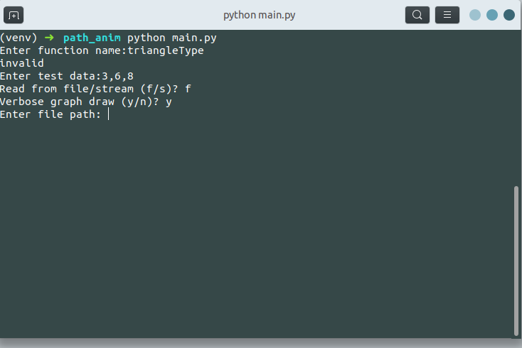
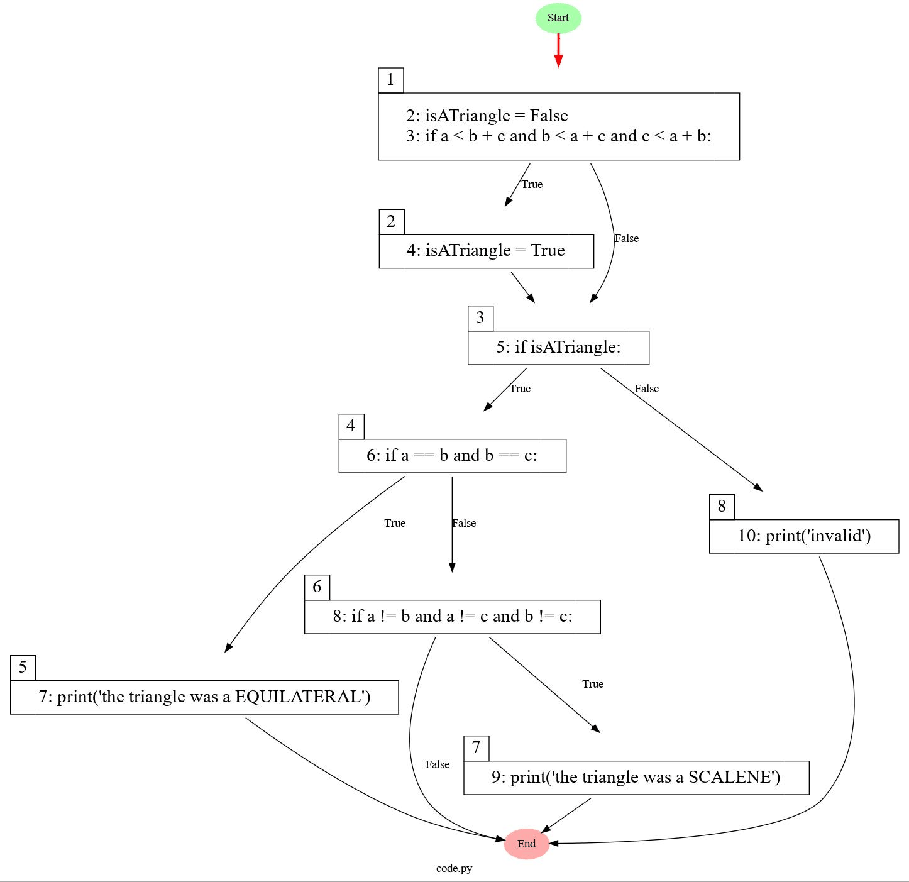

## Path animation
This package show the executed path as the gif file based on Control Flow Graph (CFG). 

## Requirement

- astor==0.8.1
- graphviz==0.19.1
- imageio==2.16.1
- numpy==1.22.3
- Pillow==9.0.1
- pydot==1.4.2
- pyglet==1.5.22
- pyparsing==3.0.7


 
## Installation

For install the required packege first install graphviz:

```bash
sudo apt-get install graphviz  # for linux
install graphviz-2.38.msi from graphviz dirctory   # for windows
```

In next step run the install.py script:

```bash
python install.py
```

## Usage

- step1. use the created virtualenvironment created as venv:

```bash
source ./venv/bin/activate  # for linux
.\venv\Scripts\activate   # for windows
```

- step2. copy your function syntax to code.py file. for example the triangleType function shown as below:

```python
def triangleType(a, b, c):
    isATriangle = False
    if (a < b + c) and (b < a + c) and (c < a + b):
        isATriangle = True
    if isATriangle:
        if (a == b) and (b == c):
            print("the triangle was a EQUILATERAL")
        elif (a != b) and (a != c) and (b != c):
            print("the triangle was a SCALENE")
    else:
        print("invalid")
triangleType(3, 5, 8)
```

- step3. run main.py: 
```bash
python main.py
```

- step4. Entenr function name, test data, select file type as f to read the function from file and select verbose mode <br><br>:



## output of example:




## License
[MIT]()
